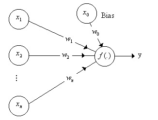
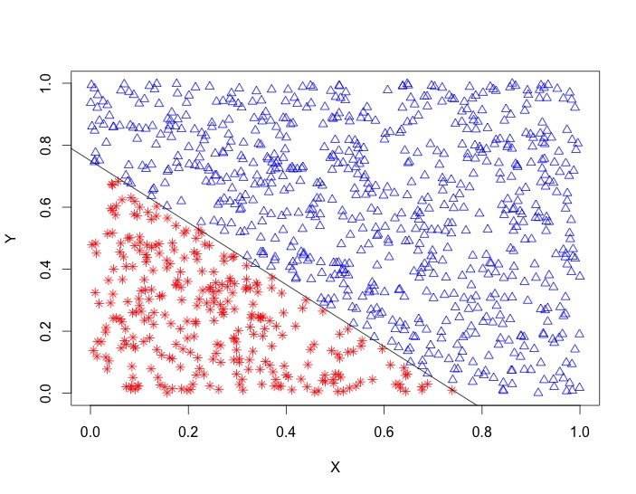

Perceptron
==
Here we take a look at one of the simplest learning algorithms in machine learning. At its simplest, a percetron takes a vector of inputs **x** = (x1, x2,...,xn), weights each component and outputs a single binary variable, "yes" or "no", depending on whether a weighted sum exceeds some threshold.

We can visualize our perceptron as a collection of inputs that are weighted to give a single output: 

If we interpret the perceptron's decision boundary geometrically, we see itis exactly a hyperplane and thus our perpetron is really only good for classifying linearly separable data.

So where exactly do these weights come from? This is where our learning algorithm comes in. We briefly outline the steps it takes here, but for a more in-depth look check out the `Perceptron` function in the R source file.

1. Initialize w0 = - threshold and all other weights to random values (I use random uniform but random normal are OK).
2. While any point is misclassified:
   ..1. For each observation:
	..1. If label and classification conflict, update weight and continue

That's it, pretty simple. In each iteration we compute out "expected" classification for each observation. If that expectation does not match the label for that observation, the weights are updated accordingly so that we are more likely to correctly classify that observation in the future.

Examples
==
As is, the code can handle as many dimensions as you'd like but for simplicity's sake I'd like to show an example in 2D and one in 3D.

In 2D we set our threshold to 0.75 and generate our data using `Random.Unit(1000, 2, 0.75)`:  

The true decision boundary is *y = -x + 0.75*. We then call `Perceptron` using the output from `Random.Unit` and our threshold and find the line *y = -0.9965821x + -0.7490508*, a pretty good approximation: 
